[//]: # (Profile picture by hcnone: https://twitter.com/hcnone)
[//]: # (Girl on the README by Rivhey: https://www.reddit.com/user/Rivhey/)

---
<h3 align=center>
  An idiot admires complexity, a genius admires simplicity.
</h2>

  - Terry Davis

---

## 🔗 Links
 
 

---
> [!IMPORTANT]
> The age of AI and [enshitification](https://www.merriam-webster.com/slang/enshittification) is here and I refuse to participate.  
> I’m gradually migrating my projects to my self-hosted git: https://git.gamriel.com/
>
> Take back control. Build your own spaces. Self-host. Support open source.

---

# ✨ Some Cool Projects
### [Resume Site](https://github.com/GameBear64/resume-site/tree/main)  
A resume site to showcase all my knowledge and experiences in one place.  

 
 

---

### [Stylish Closet](https://github.com/GameBear64/Clothes-Shop)  
Simple and minimal clothes shop.  

 
 

---

### [PantoneWall](https://pantone-wall.vercel.app/)  
Wallpaper generator using the Pantone colors.  

 
 

---

 

<i>Excluding activity from [GitBar](https://git.gamriel.com/)</i>

---

# 📌 Other Interests

     

<i>*All badges with icons are links to their respective websites</i>
